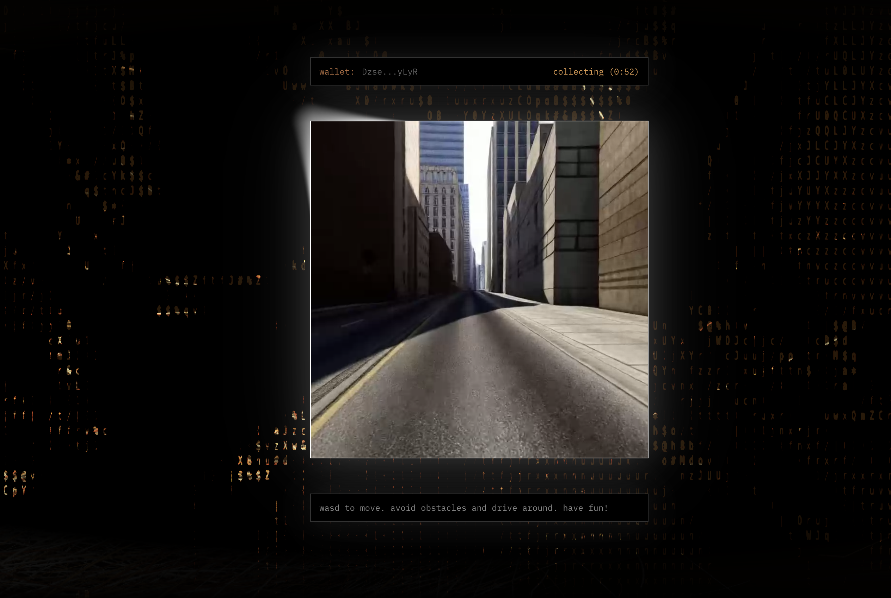
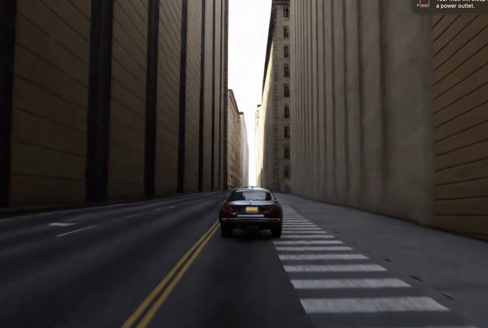
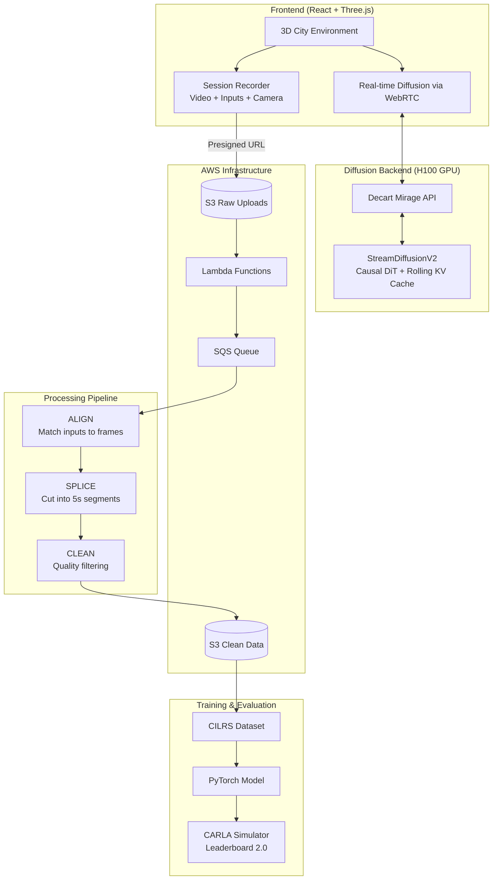

# Scale Diffusion

**Crowdsourced training data for autonomous driving—collected through gameplay in a diffusion world model.**



---

## The Problem

The autonomous vehicle industry has poured over **$16 billion** into self-driving technology, with companies like Waymo, Cruise, and Tesla spending billions on data collection alone. Each prototype vehicle costs **$250,000–$500,000** to equip with sensors. Labeling that data? Enterprise contracts run **$100,000–$400,000+ annually**, with 3D point cloud annotations costing **$0.50–$5.00 per frame**.

The bottleneck isn't algorithms—it's data. And the traditional approach of deploying expensive fleets to collect it doesn't scale.

## Our Solution

**What if we could collect driving data from millions of people playing a game?**

Scale Diffusion turns data collection into a game. Players drive through AI-generated city streets while we capture their inputs—steering, acceleration, braking—synchronized with video frames. The result: high-quality training data at a fraction of the cost.

- **Play a game** → Generate training data
- **Contribute data** → Earn rewards
- **Train models** → Improve autonomous driving


---

## How It Works

### 1. Players Drive Through AI-Generated Streets

A 3D city environment, accurately scraped with NYC public data, is rendered with Three.js and transformed in real-time by a diffusion model, creating photorealistic driving scenarios. Players navigate using WASD controls while the system records everything.

### 2. Sessions Are Recorded & Uploaded

Each 1-minute session captures:
- **Video frames** at 30fps (1280x720)
- **Control inputs** (steering, throttle, brake)
- **Camera positions** and orientations
- **Latency measurements** for frame synchronization

Data is uploaded directly to AWS S3 via presigned URLs.

### 3. Data Is Processed Into Training Format

Raw sessions are converted to CILRS (Conditional Imitation Learning) format:
- Frames extracted and resized to 256x256
- Inputs aligned to frames using RTT offset
- Quality filtering removes blur and artifacts

### 4. Models Are Trained & Evaluated

The processed data trains end-to-end driving models that are evaluated on the CARLA Leaderboard 2.0—the industry standard benchmark for autonomous driving.



---

## Architecture



---

## Tech Stack

### Real-time Diffusion Pipeline

| Component | Technology | Details |
|-----------|------------|---------|
| **Diffusion Engine** | StreamDiffusionV2 (MLSys 2026) | Causal DiT architecture with rolling KV cache |
| **Model** | Wan2.1-T2V | 1.3B and 14B parameter variants |
| **Inference** | Multi-GPU H100 | CUDA 12.4+, bfloat16 precision, Flash Attention |
| **Streaming** | Decart Mirage | WebRTC real-time video diffusion API |
| **Resolution** | 480p @ 16fps | Configurable up to 832x480 |

### Frontend

| Component | Technology |
|-----------|------------|
| **Framework** | React 19 + Vite |
| **3D Rendering** | Three.js (NYC city environment) |
| **Video Streaming** | WebRTC |
| **Recording** | MediaRecorder API (VP8, 1280x720 @ 30fps) |
| **Wallet** | Solana Web3.js |

### Backend & Infrastructure

| Component | Technology |
|-----------|------------|
| **Infrastructure** | AWS (Lambda, S3, SQS) via SST v3 |
| **Upload** | Presigned S3 URLs |
| **Processing** | Python + LangGraph pipeline |
| **Package Management** | Bun (TypeScript), uv (Python) |

### Training & Evaluation

| Component | Technology |
|-----------|------------|
| **Framework** | PyTorch 2.x |
| **Model** | CILRS (Conditional Imitation Learning) |
| **Simulator** | CARLA 0.9.15 |
| **Benchmark** | CARLA Leaderboard 2.0 |

---

## Benchmark Results

Model trained on crowdsourced data, evaluated on CARLA Leaderboard 2.0:

| Metric | Score |
|--------|-------|
| **Driving Score** | 7.59 |
| **Route Completion** | 47.41% |
| **Infraction Penalty** | 0.21 |

### Infraction Breakdown

| Infraction Type | Rate (per km) |
|-----------------|---------------|
| Collisions with vehicles | 36.39 |
| Collisions with layout | 9.10 |
| Stop sign infractions | 9.10 |
| Agent blocked | 18.20 |
| Min speed infractions | 18.20 |
| Off-road infractions | 0.02 |
| Collisions with pedestrians | 0.00 |
| Red light infractions | 0.00 |

*Evaluated on Town13 with camera + speedometer sensors only.*

---

## Project Structure

```
scale-diffusion/
├── frontend/          # React game with diffusion overlay
├── backend/           # AWS infrastructure (Lambda, S3, SQS)
├── pipeline/          # Data processing pipeline (LangGraph)
├── carla_garage/      # CILRS training & CARLA evaluation
└── StreamDiffusionV2/ # Real-time diffusion engine (MLSys 2026)
```

---

## Getting Started

### Frontend

```bash
cd frontend
bun install
bun run dev
```

### Backend

```bash
cd backend
bun install
bunx sst dev
```

### Training Pipeline

```bash
cd carla_garage
uv sync
uv run python cilrs_eval.py
```

### StreamDiffusionV2 (Local Diffusion)

```bash
cd StreamDiffusionV2
conda create -n stream python=3.10.0
conda activate stream
pip install torch==2.6.0 torchvision==0.21.0 --index-url https://download.pytorch.org/whl/cu124
pip install -r requirements.txt
python setup.py develop
```

---

## Training Data Format

Each session produces:

```
route_{session_id}/
├── rgb_front/           # 256x256 JPEG frames
│   ├── 00000.jpg
│   ├── 00001.jpg
│   └── ...
└── measurements.json    # Per-frame control data
```

**measurements.json** contains:
- Position (x, y, theta)
- Speed
- Control commands (steer, throttle, brake)
- Navigation command (left/right/straight/follow)

---

## License

MIT
