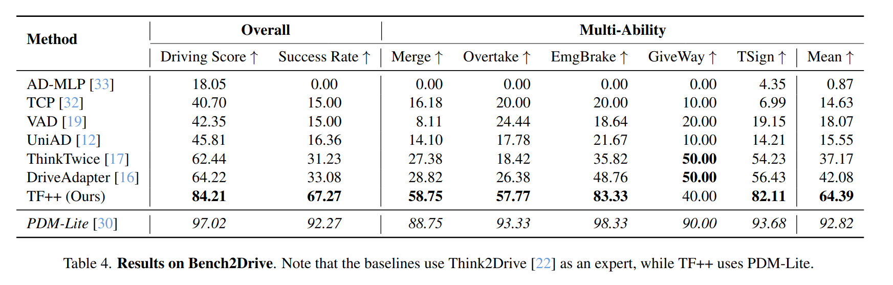
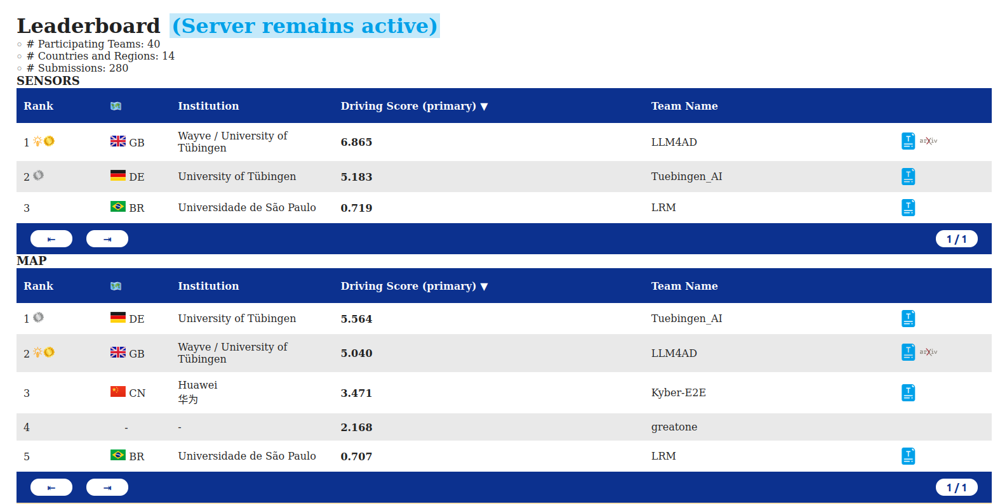

<p align="center">
  
  <h3 align="center">
        <a href="https://arxiv.org/abs/2412.09602"> LB2 Technical Report</a> | <a href="https://arxiv.org/abs/2306.07957.pdf"> Paper</a> | <a href="https://youtu.be/ChrPW8RdqQU">Video</a> | <a href="https://youtu.be/x_42Fji1Z2M?t=1073">Talk</a> | <a href="https://www.cvlibs.net/shared/common_misconceptions.pdf"> Slides</a> | <a href="https://github.com/autonomousvision/carla_garage/tree/main/assets/Jaeger2023ICCV_Poster.pdf">Poster</a>
  </h3>
</p>

<p align="center" style="font-size:40px;">
<b> A starter kit for the <a href="https://leaderboard.carla.org/">CARLA leaderboard 2.0</a> </b>
</p>

[](https://paperswithcode.com/sota/carla-leaderboard-2-0-on-carla?p=hidden-biases-of-end-to-end-driving-models)
[](https://paperswithcode.com/sota/bench2drive-on-bench2drive?p=hidden-biases-of-end-to-end-driving-models)


<p align="center" style="font-size:20px;">
This repository contains the first complete starter kit for the CARLA leaderboard 2.0 where all components are open-source including the dataset, expert driver, evaluation and training code.
We additionally provide pre-trained model weights for TransFuser++ which is the best open-source model at the time of publication. The paper <a href="https://arxiv.org/abs/2306.07957"> Hidden Biases of End-to-End Driving Models </a> describes the method and the <a href="https://arxiv.org/abs/2412.09602"> LB2 Technical Report</a> discusses the changes we made to adapt TransFuser++ to the CARLA leaderboard 2.0. <br/><br/>
The leaderboard 1.0 code can be found on the <a href="https://github.com/autonomousvision/carla_garage/tree/leaderboard_1"> leaderboard_1</a> branch.
</p>

## Contents

1. [Setup](#setup)
2. [Pre-Trained Models](#pre-trained-models)
3. [Local Evaluation and Debugging](#local-evaluation-and-debugging)
4. [Benchmarking](#benchmarking)
5. [Dataset](#dataset)
6. [Data Generation](#data-generation)
7. [Training](#training)
8. [Additional Documentation](#additional-documentation)
9. [Citations](#citations)

## Setup

Clone the repo, setup CARLA 0.9.15, and build the conda environment:
```Shell
git clone https://github.com/autonomousvision/carla_garage.git
cd carla_garage
git checkout leaderboard_2
chmod +x setup_carla.sh
./setup_carla.sh
conda env create -f environment.yml
conda activate garage_2
```

Before running the code, you will need to add the following paths to PYTHONPATH on your system:
```Shell
export CARLA_ROOT=/path/to/CARLA/root
export WORK_DIR=/path/to/carla_garage
export PYTHONPATH=$PYTHONPATH:${CARLA_ROOT}/PythonAPI/carla
export SCENARIO_RUNNER_ROOT=${WORK_DIR}/scenario_runner
export LEADERBOARD_ROOT=${WORK_DIR}/leaderboard
export PYTHONPATH="${CARLA_ROOT}/PythonAPI/carla/":"${SCENARIO_RUNNER_ROOT}":"${LEADERBOARD_ROOT}":${PYTHONPATH}
```
You can add this in your shell scripts or directly integrate it into your favorite IDE. \
E.g. in PyCharm: Settings -> Project -> Python Interpreter -> Show all -> garage (need to add from existing conda environment first) -> Show Interpreter Paths -> add all the absolute paths above (without pythonpath).

## Pre-Trained Models
We provide a set of [pretrained models](https://s3.eu-central-1.amazonaws.com/avg-projects-2/garage_2/models/pretrained_models.zip).
The models are licensed under [CC BY 4.0](https://creativecommons.org/licenses/by/4.0).

These are not the exact model weights we used in the CVPR CARLA 2024 challenge but re-trained models with similar performance.
We currently provide 1 set of models with 3 different training seeds trained on all towns (i.e., including Town13) for the Bench2Drive and CARLA leaderboard 2.0 test routes benchmarks.
We will add models for the validation benchmark at a later point.

Each folder has an `args.txt` containing the training hyperparameters, a `config.json` containing all hyperparameters which will automatically be loaded and `model_0030_0.pth` files containing the model weights. The last number in the model file indicates the seed/training repetition.

## Local Evaluation and Debugging

To evaluate a model, you need to start a CARLA server:
```Shell
cd /path/to/CARLA/root
./CarlaUE4.sh
```
Afterwards, run [leaderboard_evaluator_local.py](leaderboard/leaderboard/leaderboard_evaluator_local.py) as the main python file.

The leaderboard in the leaderboard folder is the original leaderboard (with some minor changes like extra seeding options and an upgrade to python 3.10). The leaderboard_autopilot is a modified version of the leaderboard that stores extra information which helps the privileged expert driver solve the scenarios. It is used for data collection.
The leaderboard in the Bench2Drive folder is a modified version of the leaderboard which was adapted by the Bench2Drive team for short evaluation routes.

Set the `--agent-config` option to a folder containing a `config.json` and one or more `model_0030.pth` files. If multiple models are present in the folder, their predictions will be combined to an ensemble. <br>
Set the `--agent` to [sensor_agent.py](team_code/sensor_agent.py). <br>
The `--routes` option should be set to a route file, for example [debug.xml](leaderboard/data/debug.xml). <br>
Set `--checkpoint ` to `/path/to/results/result.json`


Set `export SAVE_PATH=/path/to/results` to save additional logs or visualizations

The code has the optional feature to generate visualizations. To turn it on, set the environment variables `export DEBUG_CHALLENGE=1`, and the path where you want the visualization to be stored `export SAVE_PATH=/path/to/visualization`. <br>

## Benchmarking

### Bench2Drive
Bench2Drive is a CARLA benchmark proposed by the paper [Bench2Drive: Towards Multi-Ability Benchmarking of Closed-Loop End-To-End Autonomous Driving](https://arxiv.org/abs/2406.03877). It consists of 220 very short (~150m) routes split across all towns with 1 safety critical scenario in each route.
Since it uses all towns for training, the methods have seen the test towns during training, so it can be considered a 'training' benchmark (reminiscent of level 4 driving).
The benchmark also comes with a training dataset generated by the [Think2Drive](https://arxiv.org/abs/2402.16720) expert, but we don't use it here since we observe that TransFuser++ trained with data from the [PDM-Lite](https://arxiv.org/abs/2312.14150) expert achieves much better results than all the other methods trained with Think2Drive (see picture below).
The benchmark and additional instructions can be found in the [Bench2Drive](Bench2Drive) folder.
It is run by executing the bash script [run_evaluation_tf++.sh](Bench2Drive/leaderboard/scripts/run_evaluation_tf++.sh). You need to adjust the script with your paths and number of GPUs (by default, the script assumes 8 GPUs are available on the node.) To give a rough estimate, it takes around ~4 hours to evaluate TF++ on Bench2Drive with 8x2080ti. For more details on how to aggregate the results, see the [README](Bench2Drive/README.md).



The Bench2Drive folder is a copy of version 0.0.3 of the [Bench2Drive repository](https://github.com/Thinklab-SJTU/Bench2Drive). Please cite the [Bench2Drive paper](https://arxiv.org/abs/2406.03877) when using the benchmark.

### CARLA leaderboard 2.0 validation routes
The [CARLA leaderboard 2.0 validation routes](leaderboard/data/routes_validation.xml) is a set of 20 long (~12 km) routes in Town 13. While driving along the routes, the agent has to solve around 90 safety critical scenarios per route consisting of [21 different types](https://leaderboard.carla.org/scenarios/) (38 counting variations).
As its name suggests, this is a 'validation' benchmark, so data from Town 13 may not be used during training (reminiscent of level 5 driving).
To train a model for this benchmark, use the training command line option `--setting 13_withheld`.
We recommend running 3 seed repetitions of the 20 routes with different seeds to reduce the impact of evaluation variance (which is quite high).

Due to the length of the routes as well as the large number of scenarios per route, the scores on this benchmark are much lower than on Bench2Drive and other benchmarks.
The CARLA leaderboard 2.0 validation routes are probably the most challenging public autonomous driving benchmark at the time of writing (Dec. 2024), so they are ideal for showcasing improvements over the state-of-the-art method(s).

Evaluation is best done by evaluating the 20*3 routes in parallel. We use a SLURM cluster with 2080ti GPUs for this. We provide our [evaluation script](evaluate_routes_slurm_tfpp.py) for this. It parallelizes the 60 routes across 60 jobs and monitors if any jobs crashed, restarting them as needed. You need to set your paths with the console arguments. The script is started via `sbatch run_evaluation_slurm_tfpp.sh` which starts the evaluation for every training seed/repetition you have (change as needed). Make sure your conda environment is active. For other types of clusters, you need to adapt the script accordingly. To give you a rough idea, with 14 GPUs, evaluation is typically done within a day. The [max_num_jobs.txt](max_num_jobs.txt) file specifies the maximum number of jobs the script will spawn and can be edited while running the evaluation. Keep it low initially and increase the number once your setup works.

The benchmark revealed a flaw in the common Driving Score metric, which for long routes and lower scores (that SOTA is currently at) can assign a lower driving score to a better method. To fix this problem, we propose the Normalized Driving Score metric, which does not have this issue but otherwise is similar in difficulty. For an in depth discussion of the problem and solution, please read [Zimmerlin 2024, Chapter 6](https://kashyap7x.github.io/assets/pdf/students/Zimmerlin2024.pdf).

The normalized driving score and other metrics for a detailed analysis can be computed by running the following python script, which will aggregate all given result files (in case the evaluation was distributed across GPUs) and compute the additional metrics.
```Shell
python ${WORK_DIR}/tools/result_parser.py --xml ${WORK_DIR}/leaderboard/data/routes_validation.xml --results /path/to/folder/containing_json_files
```

### CARLA leaderboard 2.0 test routes
The CARLA leaderboard test routes are similar to the validation routes, with the difference being that the test town 14 was not publicly released, and the evaluation is done by a third party ensuring fair results.
It works by creating a docker container with your model and code and uploading it to a third party evaluation server.
Instructions for submitting your model to the test server can be found on the [CARLA leaderboard website](https://leaderboard.carla.org/submit/) as well as [eval.ai](https://eval.ai/web/challenges/challenge-page/2098/overview), where you can view your results.
The CARLA leaderboard test routes are frequently used for competitions at workshops of top tier conferences.
TransFuser++ achieved second place at the [CVPR 2024](https://cvpr.thecvf.com/Conferences/2024/News/Workshop-Winners) [CARLA Autonomous Driving Challenge](https://opendrivelab.com/cvpr2024/workshop/) (Team Tuebingen_AI).



At the time of writing (Dec. 2024) the CARLA leaderboard test server is unfortunately temporarily closed and does not accept submissions. 
By the terms of the competition, it is not allowed to evaluate privileged methods like PDM-Lite on the CARLA leaderboard 2.0 test routes.

To submit to the CARLA leaderboard, you need docker installed on your system (as well as the nvidia-container-toolkit to test it). To generate and test the dockerfile we provide the scripts [make_docker.sh](tools/make_docker.sh) and [run_docker.sh](tools/run_docker.sh). You need to change the paths to fit your system and edit variables in [Dockerfile.master](tools/Dockerfile.master).

Note that the CARLA leaderboard 2.0 test routes should not be confused with the devtest routes, which are a set of 2 routes for development testing aka debugging. The devtest routes are in the training town, miss many scenarios and lack diversity, so they are not suitable for benchmarking.

### Longest6 v2
[Longest6](https://www.cvlibs.net/publications/Chitta2022PAMI.pdf) is a benchmark consisting of 36 medium length routes (~1-2 km) from leaderboard 1.0 in towns 1-6. We have adapted the benchmark to the new CARLA version 0.9.15 and leaderboard/scenario runner code. The benchmark features the 7 scenario types from leaderboard 1.0 (but implemented with the leaderboard 2.0 logic). The scenario descriptions were created by converting the leaderboard 1.0 scenarios with the [CARLA route bridge](tools/route_bridge.py) converter. It can serve as a benchmark with intermediate difficulty.
Note that the results of models on Longest6 v2 are not directly comparable to the leaderboard 1.0 longest6 numbers.
The benchmark can be found [here](leaderboard/data/longest6.xml) and the individual route files [here](leaderboard/data/longest6_split). Unlike the leaderboard 1.0 version, there are no modifications to the CARLA leaderboard code. Longest6 is a training benchmark, so training on Town 01-06 is allowed.

### Common mistakes in benchmarking autonomous driving
Benchmarking entire autonomous driving stacks is hard, and it is easy to get important subtle details wrong.
Unfortunately, the literature is riddled with these methodological mistakes. As an attempt to improve this situation we have written a guide on [common mistakes in benchmarking](docs/common_mistakes_in_benchmarking_ad.md), for authors to avoid them and reviewers to catch them.

## Dataset
We released the dataset we used to train the released model.
Note that this dataset was generated with a slightly older version of PDM-Lite than we have in the repository.
The dataset is licensed under [CC BY 4.0](https://creativecommons.org/licenses/by/4.0).
You can download it via.
```Shell
cd /path/to/carla_garage/tools
bash download_data.sh
```

The script will download the data to `/path/to/carla_garage/data`. This is also the path you need to set `--root_dir` to for training. The script will download and unzip the data with 39 parallel processes. The download is roughly 364 GB large. To download from China, you might need a high speed VPN.

 ## Data Generation
This repository uses the open source expert PDM-Lite from the paper [DriveLM](https://arxiv.org/abs/2312.14150) to generate the dataset above.
To re-generate the data we provide a script for a SLURM cluster which parallelizes data collection across many GPUs (2080ti in our case). You need to change the path etc. in the script. The script is started via `sbatch 0_run_collect_dataset_slurm.sh`.
Again, increase the number in [max_num_jobs.txt](max_num_jobs.txt) once your setup works.

Dataset generation is similar to evaluation. You can debug data collection by changing the `--agent` option of [leaderboard_evaluator_local.py](leaderboard_autopilot/leaderboard/leaderboard_evaluator_local.py) to [data_agent.py](team_code/data_agent.py) and the `--track` option to `MAP`. In addition, you need to set the following environment flags:
```Shell
export DATAGEN=1
export SAVE_PATH=/path/to/dataset/Routes_{route}_Repetition{repetition}
export TOWN=Town12
export REPETITION=0
export SCENARIO_RUNNER_ROOT=/path/to/scenario_runner_autopilot
```
PDM-Lite uses a modified version of the CARLA leaderboard that exposes additional information about the scenarios and makes data collection easier. They can be found in the [leaderboard_autopilot](leaderboard_autopilot) and [scenario_runner_autopilot](scenario_runner_autopilot) folders.
The routes for data collection are stored in [data](data).
The dataset provided in this repository is not perfect. At some point while improving the model you will likely need to collect an improved version.

 ## Training

Agents are trained via the file [train.py](team_code/train.py). Examples of how to use it are provided for [shell](team_code/shell_train.sh) and [SLURM](team_code/slurm_train.sh). You need to activate the garage conda environment before running it. It first sets the relevant environment variables and then launches the training with torchrun. Torchrun is a pytorch tool that handles multi-gpu training. If you want to debug on a single gpu simply set --nproc_per_node=1. The training script has many options to configure your training, you can list them with python train.py --help or look through the code. The most important ones are:

```Shell
--id your_model_000 # Name of your experiment
--batch_size 16 # Batch size per GPU
--setting all # Which towns to withhold during training. Use 'all' for leaderboard test routes and bench2drive, 13_withheld for the leaderboard validation routes.
--root_dir /path/to/dataset # Path to the root_dir of your dataset
--logdir /path/to/models # Root dir where the training files will be stored
--cpu_cores 20 # Total number of cpu cores on your machine
```

Training is normally done in 2 stages. For the perception pre-training stage, first turn off the checkpoint prediction and classification by setting:
```Shell
--use_controller_input_prediction 0
```
After training the model, run the script a second time for stage 2 with:
```Shell
--use_controller_input_prediction 1
--continue_epoch 0
--load_file /path/to/model/from/stage1/model_030.pth
```
The load_file option is usually used to resume a crashed training run, but with --continue_epoch 0 the training will start from scratch with the pre-trained weights used for initialization.

Training takes roughly 3 days per stage on 4 A100 (40GB) GPUs.
If you are compute constrained, we recommend using only 1 stage of training, and using a smaller backbone (with a larger batch size). This will reduce the training cost, but may result in lower performance.
```Shell
--image_architecture resnet34
--lidar_architecture resnet34
```

### Training in PyCharm
You can also run and debug torchrun in PyCharm. To do that, you need to set your run/debug configuration as follows:\
In the run configuration change script to module and type in: `torch.distributed.run` \
Set the parameters to:
```Shell
--nnodes=1
--nproc_per_node=1
--max_restarts=0
/path/to/train.py
--id test_tf_000_0
```
and fill in the parameters for train.py afterward.
Environment variable can be set in `Environment Variables:`.

## Additional Documentation
- The documentation on **Coordinate systems** systems can be found [here](docs/coordinate_systems.md).

- The TransFuser model family has grown quite a lot with different variants, which can be confusing for new community members. The **[history](docs/history.md)** file explains the different versions and which paper you should cite to refer to them.

- Building a full autonomous driving stack involves quite some [**engineering**](docs/engineering.md). The documentation explains some of the techniques and design philosophies we used in this project.

- The leaderboard_1 branch can run any experiment presented in the ICCV paper. It also supports some additional features that we did not end up using. They are documented [here](docs/additional_features.md).

## Citations
If you find CARLA garage useful, please consider giving us a star &#127775;.
Please cite the following papers for the respective components of the repo:

TransFuser++ Method:
```BibTeX
@InProceedings{Jaeger2023ICCV,
  title={Hidden Biases of End-to-End Driving Models},
  author={Bernhard Jaeger and Kashyap Chitta and Andreas Geiger},
  booktitle={Proc. of the IEEE International Conf. on Computer Vision (ICCV)},
  year={2023}
}
```

TransFuser++ Leaderboard 2.0 changes
```BibTeX
@article{Zimmerlin2024ArXiv,
  title={Hidden Biases of End-to-End Driving Datasets},
  author={Julian Zimmerlin and Jens Beißwenger and Bernhard Jaeger and Andreas Geiger and Kashyap Chitta},
  journal={arXiv.org},
  volume={2412.09602},
  year={2024}
}

@mastersthesis{Zimmerlin2024thesis,
  title={Tackling CARLA Leaderboard 2.0 with End-to-End Imitation Learning},
  author={Julian Zimmerlin},
  school={University of Tübingen},
  howpublished={\textsc{url:}~\url{https://kashyap7x.github.io/assets/pdf/students/Zimmerlin2024.pdf}},
  year={2024}
}
```

PDM-Lite expert:
```BibTeX
@inproceedings{Sima2024ECCV,
  title={DriveLM: Driving with Graph Visual Question Answering},
  author={Chonghao Sima and Katrin Renz and Kashyap Chitta and Li Chen and Hanxue Zhang and Chengen Xie and Jens Beißwenger and Ping Luo and Andreas Geiger and Hongyang Li},
  booktitle={Proc. of the European Conf. on Computer Vision (ECCV)},
  year={2024}
}
```

Bench2Drive benchmark:

```BibTeX
@inproceedings{Jia2024NeurIPS,
  title={Bench2Drive: Towards Multi-Ability Benchmarking of Closed-Loop End-To-End Autonomous Driving},
  author={Xiaosong Jia and Zhenjie Yang and Qifeng Li and Zhiyuan Zhang and Junchi Yan},
  booktitle={NeurIPS 2024 Datasets and Benchmarks Track},
  year={2024}
}
```

## Acknowledgements
The original code in this repository was written by Bernhard Jaeger, Julian Zimmerlin and Jens Beißwenger. Andreas Geiger and Kashyap Chitta have contributed as technical advisors.

Open source code like this is build on the shoulders of many other open source repositories.
Particularly, we would like to thank the following repositories for their contributions:
* [scenario_runner](https://github.com/carla-simulator/scenario_runner)
* [Bench2Drive](https://github.com/Thinklab-SJTU/Bench2Drive)
* [leaderboard](https://github.com/carla-simulator/leaderboard)
* [simple_bev](https://github.com/aharley/simple_bev)
* [transfuser](https://github.com/autonomousvision/transfuser)
* [InterFuser](https://github.com/opendilab/InterFuser)
* [DriveLM](https://github.com/OpenDriveLab/DriveLM)
* [roach](https://github.com/zhejz/carla-roach/)
* [plant](https://github.com/autonomousvision/plant)
* [king](https://github.com/autonomousvision/king)
* [WorldOnRails](https://github.com/dotchen/WorldOnRails)
* [TCP](https://github.com/OpenDriveLab/TCP)
* [LearningByCheating](https://github.com/dotchen/LearningByCheating)

We also thank the creators of the numerous pip libraries we use. Complex projects like this would not be feasible without your contribution.

